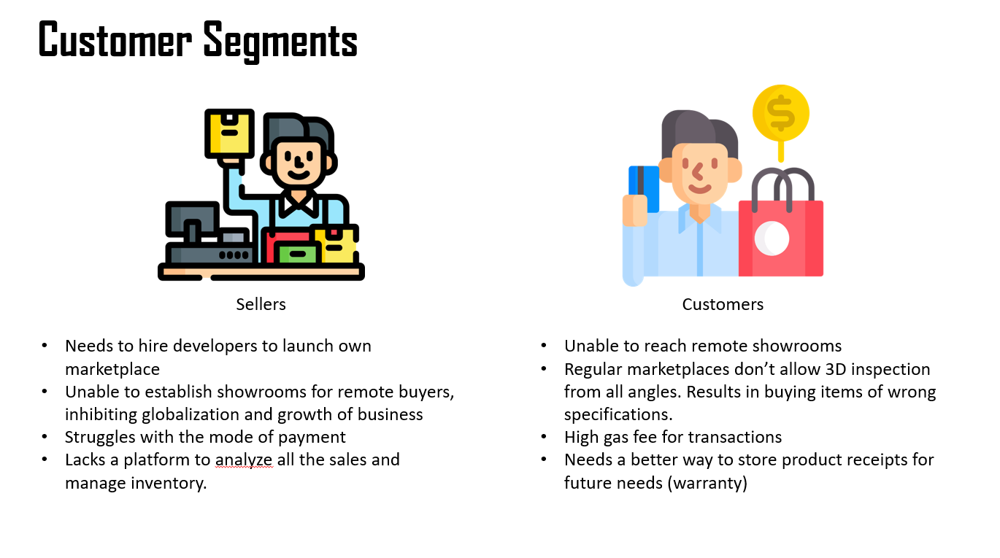
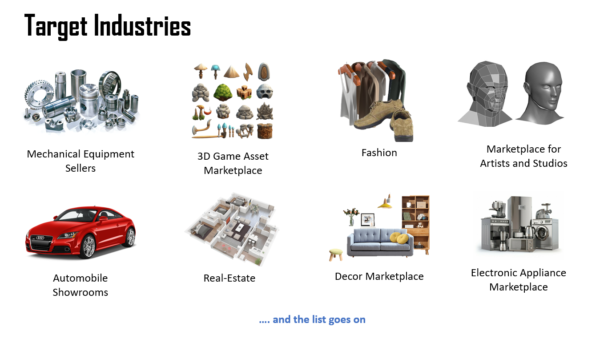
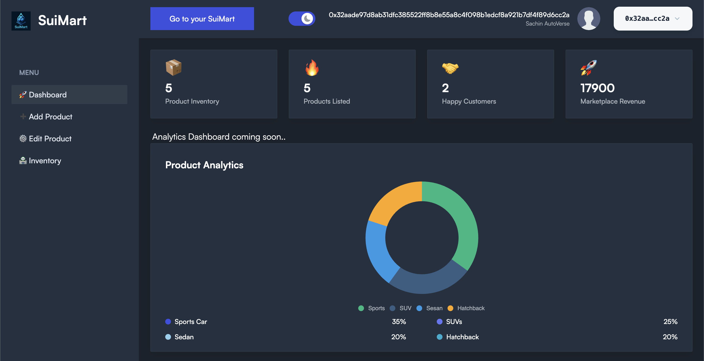
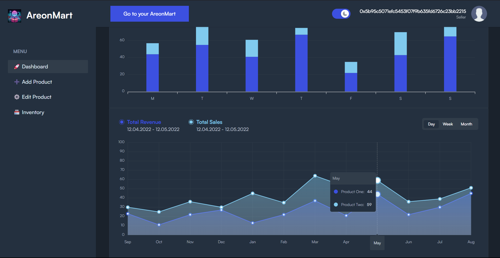
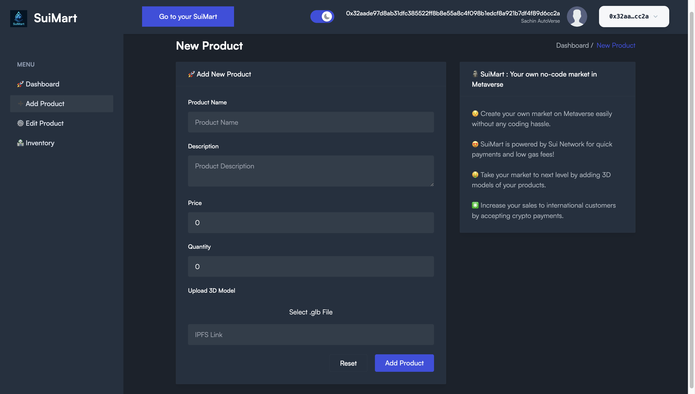
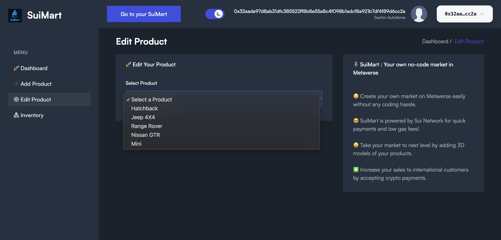
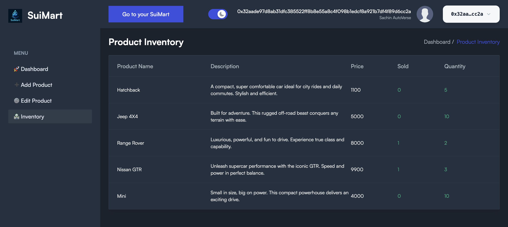
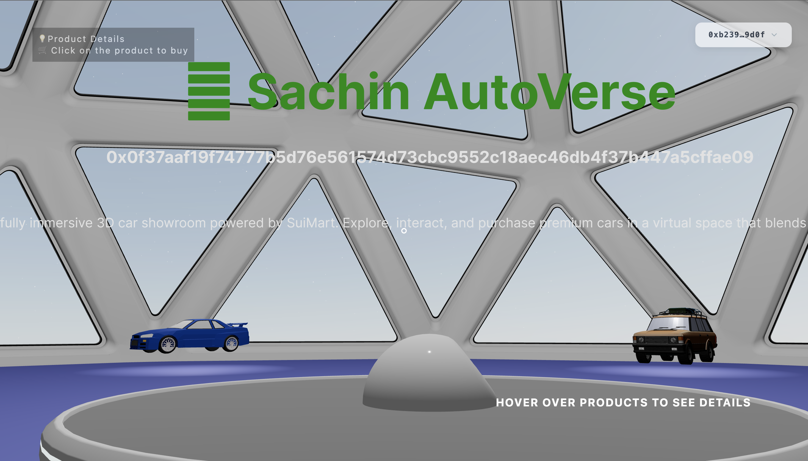
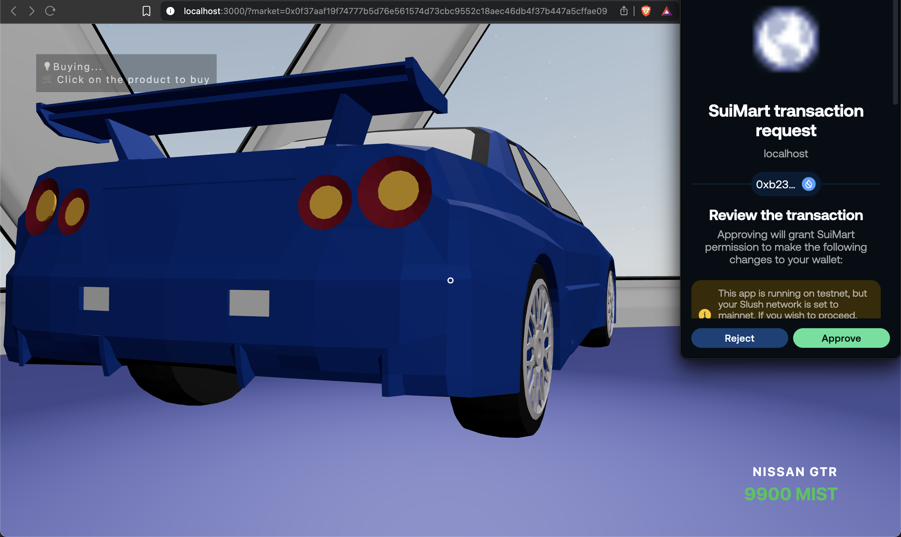
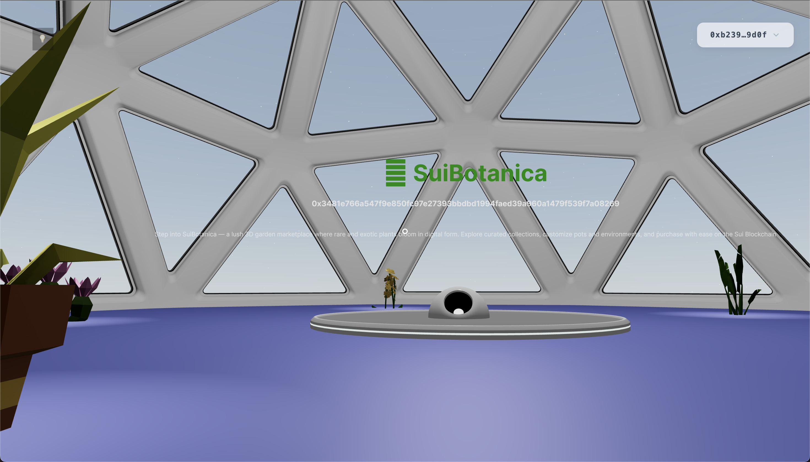

SuiMart revolutionizes e-commerce by democratizing 3D model storefronts. Whether you're an artist or a store owner, easily showcase and sell products – from cars to fashion – with personalized contracts on the Sui Blockchain. Join us in reshaping the future of online commerce, where every business finds its unique space – SuiMart, where innovation meets market accessibility.

Use SuiMart no-code tool to deploy your 3D marketplace on Sui with just a click. Go global with your 3D virtual showroom with no cost at all. SuiMart focuses on ease of use and customization ability for users. Generate the future ready 3D marketplaces for your customers, as they deserve it.

 

## 🏪 Use SuiMart  

Create your own 3D Marketplace : https://Sui-mart.vercel.app

For local development, change this line: Dashboard/src/components/Header.tsx#L68

Sample Marketplace deployed using SuiMart : https://Sui-mart-3d.vercel.app/?market=0xa6D7017fAa2d696AD3aCFeD56084449b22ebe705

Note: In case the above links are not working, you might have to disable any ad-blocker. If you use Brave Browser, disable the Brave Shields (located on the right end of the search bar).


## 🚀 Run Locally

### Smart Contracts
Inside the `smartcontract` directory, create an environment file and provide it with your private key

```
PRIVATE_KEY=<your_wallet_private_key>
```

```bash
  cd smartcontract
  npx hardhat compile
  npx hardhat run scripts/deploy.js --network testnet
```

### Dashboard - Vite Client

Create an environment file `.env.local` and provide it with Pinata JWT details [here](https://docs.pinata.cloud/frameworks/react#start-up-react-project).


```
VITE_SERVER_URL=http://localhost:8787     # your backend endpoint for pinata server
VITE_GATEWAY_URL=<mydomain>.mypinata.cloud
```

Run the Vite client:

```bash
  cd Dashboard
  npm i
  npm run dev
```

### Dashboard - Pinata Server

Create `.dev.vars` and insert these values:

```
PINATA_JWT=<your_jwt_token>
GATEWAY_URL=<mydomain>.mypinata.cloud
```

And start the Hono server:
```bash
  cd pinata-server
  npm i
  npm run dev
```

### Marketplace

```bash
  cd 3D-Marketplace
  npm i
  npm run start
```

For local development, use localhost here: Dashboard/src/components/Header.tsx#L68

## 👾 Usecases



## 📷 Screenshots

        
