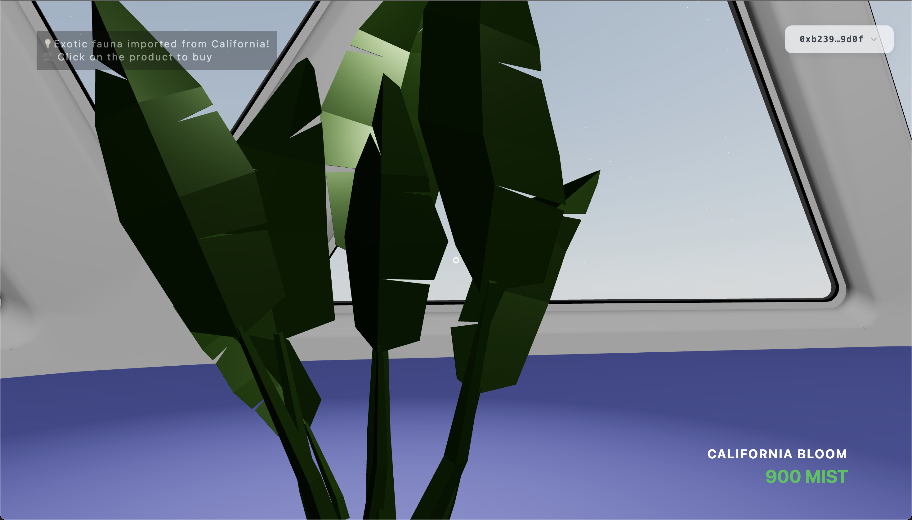

# SuiMart


## 🚀 About

**SuiMart** revolutionizes e-commerce by democratizing 3D model storefronts on the **Sui Blockchain**. With our no-code tool, anyone—from artisans to retailers—can deploy a fully interactive 3D marketplace in a single click, complete with on-chain ownership and Walrus-hosted assets.

Key highlights:
- 🛠️ **No-Code Deployment:** Spin up your own 3D MarketVerse without writing a single line of code.
- ⚡ **Sui-Native Contracts:** Each seller gets a personalized Move-based `Marketplace` contract for true on-chain ownership.
- 🌐 **Global Reach:** Zero deployment cost & gas-sponsorship for the first 100 transactions.
- 🤖 **AI Concierge (β):** Ask questions about products and receive instant responses.

## 👾 Usecases


## 📸 Demo & Preview

- Demo Car Showroom `MetaVroom`: [MetaVroom Store](https://sui-mart-3d.vercel.app/?market=0x6fe03909c447be13f471bb354d1c1516a0e4bf34ead0f0ca53ac797cce1d1da5)
  - (seller: 0x2eaec6997b466980ed3b9d6ae4999222d2052c2e823019843b52de8fd0f6dae7)
- Demo Plant Marketplace `Botanica`: [Botanica Showroom](https://sui-mart-3d.vercel.app/?market=0x3481e766a547f9e850fc97e27393bbdbd1994faed39a960a1479f539f7a08269)
  - (seller: 0x1f8c67ce6e03a186f5d205417f4b5c9ef90feb5fb496a71ca33131091950f3a6)
- Seller Page (for making new marketplace): [https://sui-mart.vercel.app](https://sui-mart.vercel.app)

Note: In case the above links are not working, you might have to disable any ad-blocker. If you use Brave Browser, disable the Brave Shields (located on the right end of the search bar).

## 📷 Screenshots

      


## 🏗️ Features

- **Factory Contract:** Deploys a unique `Marketplace` Move module per seller.
- **Seller Dashboard:** React + Vite-based UI for product uploads, editing, and analytics.
- **Immersive 3D MarketVerse:** Three.js-powered showroom with day/night cycle.
- **Secure Transactions:** One-click buy with Sui Pay integration; purchasers receive an NFT as proof of ownership.


## 📦 Tech Stack

| Component       | Technology         |
|-----------------|--------------------|
| Frontend        | React, Three.js, Vite |
| Backend         | TypeScript |
| Blockchain      | Sui Move, sui.js SDK |
| Storage         | Tusky (Walrus)      |


## 🛠️ Getting Started

### Prerequisites
- Node.js ≥ 16.x
- Yarn or npm
- Sui wallet (Sui Pay, Martian, or Ethos)

### Clone & Install
```bash
git clone https://github.com/SachinSahu431/SuiMart.git
cd SuiMart
```

#### Seller Dashboard (Client)
```bash
cd Dashboard
npm install
# Create .env with Tusky API Key
# VITE_TUSKY_API_KEY=<your_key>
npm run dev
```

For local development, change this line: Dashboard/src/components/Header.tsx#L79

#### 3D Marketplace
```bash
cd 3d-marketplace
npm install
# Create .env with:
# REACT_APP_TUSKY_API_KEY=<your_token>
npm run start
```


## 📄 Contract Details

SuiMart PackageId:
0x69c44588e703cc6022611b99949a39f87210b5e2299ecff90645dc0f34074166

https://suiscan.xyz/testnet/object/0x69c44588e703cc6022611b99949a39f87210b5e2299ecff90645dc0f34074166/contracts

